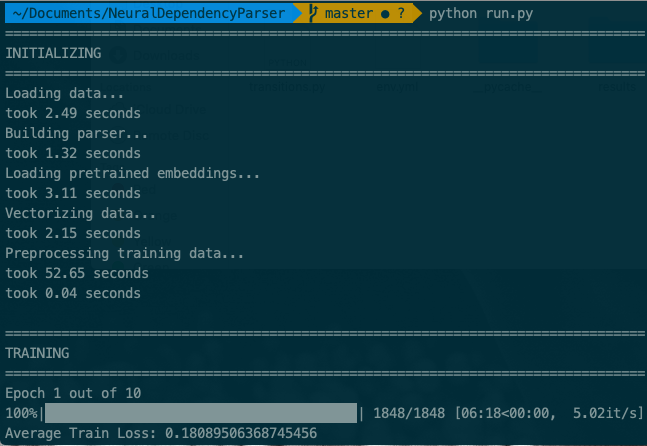

## Neural Dependecy Parser

This repository is a pytorch implementation of [A Fast and Accurate Dependency Parser using Neural Networks](https://cs.stanford.edu/~danqi/papers/emnlp2014.pdf). The feature set used in the code is same as described in the paper. The result, however, achieved by this implementation is 87.5 instead of 91.2 as in the paper.

### Prerequisites

- Python3.7
- Conda

### Setup

```
git clone https://github.com/nitinprakash96/Neural-Dependency-Parser.git # Clone the repo

conda env create --file env.yml # Setup the environment

python run.py 
```

### Training

Make sure to set `debug=False`, when training on entire corpus. Else you can also use `debug=True` to see the performance on a reltively small dataset.

